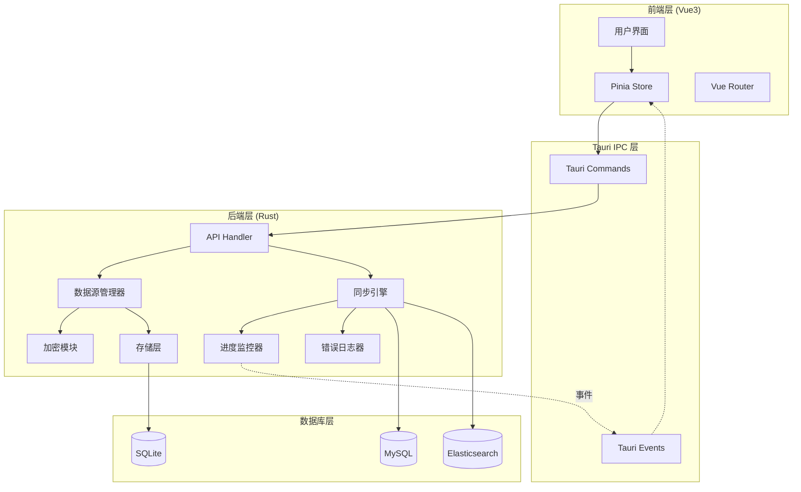

# 设计文档 - 数据同步工具

## 概述

数据同步工具是一个基于 Tauri + Vue3 + TypeScript 的桌面应用，用于在 MySQL 和 Elasticsearch 之间进行双向数据同步。系统采用前后端分离架构，前端使用 Vue3 + Naive UI 构建用户界面，后端使用 Rust 实现高性能的数据同步引擎。

### 技术栈

**前端：**
- Vue 3.4+ (Composition API)
- TypeScript 5.0+
- Naive UI 2.38+
- Pinia (状态管理)
- Vite 5.0+ (构建工具)

**后端：**
- Rust 1.75+
- Tauri 2.0+
- sqlx 0.7+ (MySQL 客户端)
- elasticsearch 8.0+ (ES 客户端)
- tokio 1.35+ (异步运行时)
- serde (序列化)
- aes-gcm (加密)

**存储：**
- SQLite (配置持久化)

## 架构设计

### 系统架构图



### 分层架构

**1. 表现层 (Presentation Layer)**
- 负责用户交互和界面展示
- 使用 Naive UI 组件库
- 通过 Pinia 管理应用状态
- 通过 Tauri Commands 调用后端功能

**2. 应用层 (Application Layer)**
- Tauri Commands 处理前端请求
- 协调各个业务模块
- 处理错误和异常

**3. 业务层 (Business Layer)**
- 数据源管理
- 同步引擎
- 进度监控
- 错误日志

**4. 数据层 (Data Layer)**
- 配置持久化
- 数据库连接
- 数据加密

## 组件和接口

### 前端组件

#### 1. 数据源管理组件 (DataSourceManager)

**职责：**
- 显示数据源列表
- 添加/编辑/删除数据源
- 测试数据源连接
- 密码显示/隐藏切换

**接口：**
```typescript
interface DataSource {
  id: string;
  name: string;
  type: 'mysql' | 'elasticsearch';
  host: string;
  port: number;
  username: string;
  password: string; // 加密存储
  database?: string; // MySQL 专用
  createdAt: string;
  updatedAt: string;
}

interface DataSourceStore {
  dataSources: DataSource[];
  loading: boolean;
  
  // 方法
  fetchDataSources(): Promise<void>;
  addDataSource(ds: DataSource): Promise<void>;
  updateDataSource(id: string, ds: DataSource): Promise<void>;
  deleteDataSource(id: string): Promise<void>;
  testConnection(id: string): Promise<ConnectionResult>;
}

interface ConnectionResult {
  success: boolean;
  message: string;
  details?: string;
}
```

#### 2. 同步任务配置组件 (SyncTaskConfig)

**职责：**
- 创建和编辑同步任务
- 选择源和目标数据源
- 选择数据库/表/索引
- 配置同步参数

**接口：**
```typescript
interface SyncTask {
  id: string;
  name: string;
  sourceId: string;
  targetId: string;
  sourceType: 'mysql' | 'elasticsearch';
  targetType: 'mysql' | 'elasticsearch';
  
  // MySQL 配置
  mysqlConfig?: {
    databases: DatabaseSelection[];
  };
  
  // ES 配置
  esConfig?: {
    indices: IndexSelection[];
  };
  
  // 同步配置
  syncConfig: {
    threadCount: number; // 1-32
    batchSize: number;
    errorStrategy: 'skip' | 'pause';
  };
  
  status: 'idle' | 'running' | 'paused' | 'completed' | 'failed';
  createdAt: string;
  updatedAt: string;
}

interface DatabaseSelection {
  database: string;
  tables: string[]; // 选中的表
}

interface IndexSelection {
  pattern: string; // 索引名或通配符 (如 logs-*)
  matchedIndices?: string[]; // 匹配到的索引
}

interface SyncTaskStore {
  tasks: SyncTask[];
  currentTask: SyncTask | null;
  
  fetchTasks(): Promise<void>;
  createTask(task: SyncTask): Promise<void>;
  updateTask(id: string, task: SyncTask): Promise<void>;
  deleteTask(id: string): Promise<void>;
  
  // 数据库/表/索引选择
  fetchDatabases(sourceId: string): Promise<string[]>;
  fetchTables(sourceId: string, database: string): Promise<string[]>;
  fetchIndices(sourceId: string): Promise<string[]>;
  matchIndices(sourceId: string, pattern: string): Promise<IndexMatchResult>;
}

interface IndexMatchResult {
  pattern: string;
  count: number;
  preview: string[]; // 前 10 个
}
```

#### 3. 任务执行监控组件 (TaskMonitor)

**职责：**
- 显示任务执行状态
- 实时进度展示
- 任务控制（启动/暂停/恢复）
- 错误日志展示

**接口：**
```typescript
interface TaskProgress {
  taskId: string;
  status: 'running' | 'paused' | 'completed' | 'failed';
  totalRecords: number;
  processedRecords: number;
  percentage: number;
  speed: number; // 记录/秒
  estimatedTime: number; // 秒
  startTime: string;
  currentTable?: string; // 当前处理的表/索引
}

interface ErrorLog {
  timestamp: string;
  errorType: string;
  message: string;
  data?: any;
}

interface TaskMonitorStore {
  progress: TaskProgress | null;
  errors: ErrorLog[];
  
  startTask(taskId: string): Promise<void>;
  pauseTask(taskId: string): Promise<void>;
  resumeTask(taskId: string): Promise<void>;
  
  // 监听进度事件
  subscribeProgress(callback: (progress: TaskProgress) => void): void;
  subscribeErrors(callback: (error: ErrorLog) => void): void;
}
```

### 后端模块

#### 1. 数据源管理器 (DataSourceManager)

**职责：**
- 管理数据源配置的 CRUD
- 加密/解密密码
- 测试数据库连接
- 获取数据库元数据

**Rust 接口：**
```rust
pub struct DataSourceManager {
    storage: Arc<Storage>,
    crypto: Arc<CryptoService>,
}

impl DataSourceManager {
    pub async fn list_data_sources(&self) -> Result<Vec<DataSource>>;
    pub async fn get_data_source(&self, id: &str) -> Result<DataSource>;
    pub async fn create_data_source(&self, ds: DataSource) -> Result<String>;
    pub async fn update_data_source(&self, id: &str, ds: DataSource) -> Result<()>;
    pub async fn delete_data_source(&self, id: &str) -> Result<()>;
    pub async fn test_connection(&self, id: &str) -> Result<ConnectionResult>;
    
    // 元数据查询
    pub async fn get_databases(&self, id: &str) -> Result<Vec<String>>;
    pub async fn get_tables(&self, id: &str, database: &str) -> Result<Vec<String>>;
    pub async fn get_indices(&self, id: &str) -> Result<Vec<String>>;
    pub async fn match_indices(&self, id: &str, pattern: &str) -> Result<IndexMatchResult>;
}
```

#### 2. 同步引擎 (SyncEngine)

**职责：**
- 执行数据同步任务
- 管理并发线程
- 批量数据处理
- 错误处理和重试

**Rust 接口：**
```rust
pub struct SyncEngine {
    source_manager: Arc<DataSourceManager>,
    progress_monitor: Arc<ProgressMonitor>,
    error_logger: Arc<ErrorLogger>,
}

impl SyncEngine {
    pub async fn start_sync(&self, task: &SyncTask) -> Result<()>;
    pub async fn pause_sync(&self, task_id: &str) -> Result<()>;
    pub async fn resume_sync(&self, task_id: &str) -> Result<()>;
    
    // 内部方法
    async fn sync_mysql_to_es(&self, task: &SyncTask) -> Result<()>;
    async fn sync_es_to_mysql(&self, task: &SyncTask) -> Result<()>;
    async fn sync_mysql_to_mysql(&self, task: &SyncTask) -> Result<()>;
    async fn sync_es_to_es(&self, task: &SyncTask) -> Result<()>;
    
    async fn drop_and_create_target(&self, target: &DataSource, name: &str) -> Result<()>;
    async fn process_batch(&self, batch: Vec<Record>) -> Result<()>;
}
```

#### 3. 类型映射器 (TypeMapper)

**职责：**
- MySQL 和 ES 类型互相转换
- 处理特殊类型
- 主键映射

**Rust 接口：**
```rust
pub struct TypeMapper;

impl TypeMapper {
    pub fn mysql_to_es(mysql_type: &str) -> String;
    pub fn es_to_mysql(es_type: &str) -> String;
    pub fn map_primary_key(pk_value: &Value) -> String;
}

// 类型映射表
// MySQL -> ES
// INT, BIGINT -> long
// VARCHAR, TEXT -> text/keyword
// DATETIME, TIMESTAMP -> date
// BOOLEAN -> boolean
// FLOAT, DOUBLE -> double
// JSON -> object

// ES -> MySQL
// long -> BIGINT
// text/keyword -> VARCHAR(255)
// date -> DATETIME
// boolean -> BOOLEAN
// double -> DOUBLE
// object -> JSON
```

#### 4. 进度监控器 (ProgressMonitor)

**职责：**
- 跟踪同步进度
- 计算速度和预估时间
- 发送进度事件到前端

**Rust 接口：**
```rust
pub struct ProgressMonitor {
    current_progress: Arc<RwLock<HashMap<String, TaskProgress>>>,
}

impl ProgressMonitor {
    pub fn start_task(&self, task_id: &str, total: u64);
    pub fn update_progress(&self, task_id: &str, processed: u64);
    pub fn complete_task(&self, task_id: &str);
    pub fn fail_task(&self, task_id: &str, error: &str);
    pub fn get_progress(&self, task_id: &str) -> Option<TaskProgress>;
    
    // 发送事件到前端
    async fn emit_progress(&self, progress: &TaskProgress);
}
```

#### 5. 错误日志器 (ErrorLogger)

**职责：**
- 记录同步错误
- 管理当前任务的错误列表
- 发送错误事件到前端

**Rust 接口：**
```rust
pub struct ErrorLogger {
    errors: Arc<RwLock<HashMap<String, Vec<ErrorLog>>>>,
}

impl ErrorLogger {
    pub fn log_error(&self, task_id: &str, error: ErrorLog);
    pub fn get_errors(&self, task_id: &str) -> Vec<ErrorLog>;
    pub fn clear_errors(&self, task_id: &str);
    pub fn get_error_count(&self, task_id: &str) -> usize;
    
    async fn emit_error(&self, error: &ErrorLog);
}
```

#### 6. 加密服务 (CryptoService)

**职责：**
- 加密/解密密码
- 密钥管理

**Rust 接口：**
```rust
pub struct CryptoService {
    key: Vec<u8>,
}

impl CryptoService {
    pub fn new() -> Result<Self>;
    pub fn encrypt(&self, plaintext: &str) -> Result<String>;
    pub fn decrypt(&self, ciphertext: &str) -> Result<String>;
    
    fn load_or_generate_key() -> Result<Vec<u8>>;
}
```

#### 7. 存储层 (Storage)

**职责：**
- SQLite 数据库操作
- 配置持久化

**Rust 接口：**
```rust
pub struct Storage {
    pool: SqlitePool,
}

impl Storage {
    pub async fn new(db_path: &str) -> Result<Self>;
    pub async fn init_schema(&self) -> Result<()>;
    
    // 数据源操作
    pub async fn save_data_source(&self, ds: &DataSource) -> Result<()>;
    pub async fn load_data_sources(&self) -> Result<Vec<DataSource>>;
    pub async fn delete_data_source(&self, id: &str) -> Result<()>;
    
    // 任务操作
    pub async fn save_task(&self, task: &SyncTask) -> Result<()>;
    pub async fn load_tasks(&self) -> Result<Vec<SyncTask>>;
    pub async fn delete_task(&self, id: &str) -> Result<()>;
}
```

## 数据模型

### 数据库 Schema (SQLite)

```sql
-- 数据源表
CREATE TABLE data_sources (
    id TEXT PRIMARY KEY,
    name TEXT NOT NULL,
    type TEXT NOT NULL CHECK(type IN ('mysql', 'elasticsearch')),
    host TEXT NOT NULL,
    port INTEGER NOT NULL,
    username TEXT NOT NULL,
    password TEXT NOT NULL, -- 加密存储
    database TEXT,
    created_at TEXT NOT NULL,
    updated_at TEXT NOT NULL
);

-- 同步任务表
CREATE TABLE sync_tasks (
    id TEXT PRIMARY KEY,
    name TEXT NOT NULL,
    source_id TEXT NOT NULL,
    target_id TEXT NOT NULL,
    source_type TEXT NOT NULL,
    target_type TEXT NOT NULL,
    config TEXT NOT NULL, -- JSON 格式
    status TEXT NOT NULL,
    created_at TEXT NOT NULL,
    updated_at TEXT NOT NULL,
    FOREIGN KEY (source_id) REFERENCES data_sources(id),
    FOREIGN KEY (target_id) REFERENCES data_sources(id)
);

-- 加密密钥表
CREATE TABLE encryption_keys (
    id INTEGER PRIMARY KEY,
    key_data TEXT NOT NULL,
    created_at TEXT NOT NULL
);
```

### 数据流

**同步流程：**
```
1. 用户启动任务
2. 验证源和目标连接
3. 获取源数据元数据（表结构/索引映射）
4. 删除并重建目标表/索引
5. 分批读取源数据
6. 类型转换
7. 批量写入目标
8. 更新进度
9. 处理错误（跳过或暂停）
10. 完成同步
```

**数据转换流程：**
```
MySQL -> ES:
1. 读取 MySQL 行数据
2. 转换字段类型（TypeMapper）
3. 主键映射为 _id
4. 构建 ES 文档
5. Bulk API 批量插入

ES -> MySQL:
1. 读取 ES 文档
2. 转换字段类型
3. _id 映射为主键
4. 构建 INSERT 语句
5. 批量插入
```

## 正确性属性

在编写正确性属性之前，让我先进行验收标准的可测试性分析...


*属性（Property）是系统在所有有效执行中都应该保持为真的特征或行为——本质上是关于系统应该做什么的形式化陈述。属性是人类可读规范和机器可验证正确性保证之间的桥梁。*

基于需求文档中的验收标准，我定义了以下正确性属性：

### 属性 1：数据源持久化往返一致性

*对于任何*有效的数据源配置，保存后再读取应该得到等价的配置（密码解密后相同）

**验证：需求 1.1, 1.3, 12.1**

### 属性 2：密码加密存储

*对于任何*保存的数据源，直接读取存储文件中的密码字段应该是加密的（不等于明文密码）

**验证：需求 1.3, 8.1**

### 属性 3：密码加解密往返

*对于任何*明文密码，加密后再解密应该得到原始密码

**验证：需求 8.1, 8.2, 8.3**

### 属性 4：数据源更新保持 ID 不变

*对于任何*已存在的数据源，更新后其 ID 应该保持不变，但其他字段应该反映更新

**验证：需求 1.4**

### 属性 5：数据源删除后不可访问

*对于任何*被删除的数据源，后续查询该数据源应该返回不存在错误

**验证：需求 1.5**

### 属性 6：同步任务持久化往返一致性

*对于任何*有效的同步任务配置，保存后再读取应该得到等价的配置

**验证：需求 3.9, 12.2**

### 属性 7：通配符索引匹配正确性

*对于任何*索引列表和通配符模式，匹配结果中的所有索引都应该符合该模式

**验证：需求 3.5, 3.6**

### 属性 8：MySQL 到 ES 类型映射一致性

*对于任何*支持的 MySQL 数据类型，映射到 ES 类型后应该能够存储相同语义的数据

**验证：需求 3.7, 10.1, 10.3**

### 属性 9：ES 到 MySQL 类型映射一致性

*对于任何*支持的 ES 数据类型，映射到 MySQL 类型后应该能够存储相同语义的数据

**验证：需求 3.8, 10.2, 10.3**

### 属性 10：主键映射为 _id

*对于任何*从 MySQL 同步到 ES 的记录，MySQL 主键值应该等于 ES 文档的 _id 值

**验证：需求 10.5**

### 属性 11：目标表/索引删除重建

*对于任何*同步任务，执行前如果目标表/索引存在，同步后应该是新创建的（创建时间更新）

**验证：需求 4.2, 4.3, 4.4, 4.5, 4.6**

### 属性 12：批量大小自适应

*对于任何*同步任务，实际使用的批量大小应该根据目标类型自动调整（MySQL: 1000, ES: 500）

**验证：需求 4.8, 11.3, 11.4**

### 属性 13：错误跳过策略

*对于任何*配置为"跳过错误"的同步任务，遇到错误时应该记录错误并继续处理后续数据

**验证：需求 4.9**

### 属性 14：错误暂停策略

*对于任何*配置为"遇错暂停"的同步任务，遇到错误时应该暂停任务并更新状态为 paused

**验证：需求 4.10**

### 属性 15：任务状态转换正确性

*对于任何*同步任务，状态转换应该遵循：idle → running → (paused ↔ running)* → (completed | failed)

**验证：需求 5.1, 5.2, 5.3, 5.4, 5.5**

### 属性 16：进度百分比计算正确性

*对于任何*正在执行的任务，进度百分比应该等于 (已处理记录数 / 总记录数) * 100

**验证：需求 6.1, 6.2**

### 属性 17：同步速度计算正确性

*对于任何*正在执行的任务，同步速度应该等于 已处理记录数 / (当前时间 - 开始时间)

**验证：需求 6.3**

### 属性 18：错误日志包含必要信息

*对于任何*记录的错误，应该包含时间戳、错误类型、错误消息这三个必要字段

**验证：需求 7.2**

### 属性 19：错误日志不持久化

*对于任何*任务，当任务完成或应用重启后，该任务的错误日志应该被清空

**验证：需求 7.5**

### 属性 20：线程数配置范围

*对于任何*同步任务配置，线程数应该在 1-32 范围内

**验证：需求 11.1**

## 错误处理

### 错误类型

**1. 连接错误**
- 数据库无法连接
- 认证失败
- 网络超时

**处理策略：**
- 立即返回错误给用户
- 显示详细错误信息
- 不执行同步任务

**2. 数据错误**
- 类型转换失败
- 数据格式不正确
- 约束违反

**处理策略：**
- 根据用户配置的错误策略处理
- 跳过：记录错误，继续处理
- 暂停：停止任务，显示错误

**3. 系统错误**
- 内存不足
- 磁盘空间不足
- 文件权限错误

**处理策略：**
- 立即暂停任务
- 显示错误信息
- 建议用户解决系统问题

### 错误恢复

**暂停后恢复：**
- 保存当前处理位置
- 恢复时从暂停点继续
- 不重复处理已完成的数据

**失败后重试：**
- 用户可以手动重新启动失败的任务
- 重新执行完整的同步流程（删除重建）

## 测试策略

### 单元测试

**测试范围：**
- 类型映射器（TypeMapper）
- 加密服务（CryptoService）
- 通配符匹配逻辑
- 进度计算逻辑
- 错误日志记录

**测试工具：**
- Rust: `cargo test`
- TypeScript: `vitest`

**测试示例：**
```rust
#[cfg(test)]
mod tests {
    use super::*;
    
    #[test]
    fn test_mysql_int_to_es_long() {
        assert_eq!(TypeMapper::mysql_to_es("INT"), "long");
        assert_eq!(TypeMapper::mysql_to_es("BIGINT"), "long");
    }
    
    #[test]
    fn test_encrypt_decrypt_roundtrip() {
        let crypto = CryptoService::new().unwrap();
        let plaintext = "my_password_123";
        let encrypted = crypto.encrypt(plaintext).unwrap();
        let decrypted = crypto.decrypt(&encrypted).unwrap();
        assert_eq!(plaintext, decrypted);
    }
}
```

### 属性测试

**测试范围：**
- 所有定义的正确性属性
- 使用随机生成的测试数据
- 每个属性至少运行 100 次迭代

**测试工具：**
- Rust: `proptest` 或 `quickcheck`
- TypeScript: `fast-check`

**测试配置：**
- 最小迭代次数：100
- 每个测试标注对应的属性编号

**测试示例：**
```rust
use proptest::prelude::*;

// Feature: data-sync-tool, Property 3: 密码加解密往返
proptest! {
    #[test]
    fn prop_encrypt_decrypt_roundtrip(password in "[a-zA-Z0-9]{8,32}") {
        let crypto = CryptoService::new().unwrap();
        let encrypted = crypto.encrypt(&password).unwrap();
        let decrypted = crypto.decrypt(&encrypted).unwrap();
        prop_assert_eq!(password, decrypted);
    }
}

// Feature: data-sync-tool, Property 7: 通配符索引匹配正确性
proptest! {
    #[test]
    fn prop_wildcard_match_correctness(
        indices in prop::collection::vec("[a-z]{3,10}-[0-9]{4}", 10..100),
        prefix in "[a-z]{3,10}"
    ) {
        let pattern = format!("{}*", prefix);
        let matched = match_indices(&indices, &pattern);
        
        for index in matched {
            prop_assert!(index.starts_with(&prefix));
        }
    }
}
```

### 集成测试

**测试范围：**
- 完整的同步流程
- 数据源连接测试
- 任务执行和控制
- 前后端通信

**测试环境：**
- 使用 Docker 容器运行测试数据库
- MySQL 测试容器
- Elasticsearch 测试容器

**测试场景：**
1. MySQL → MySQL 同步
2. MySQL → ES 同步
3. ES → MySQL 同步
4. ES → ES 同步
5. 任务暂停和恢复
6. 错误处理（跳过/暂停）

### 端到端测试

**测试范围：**
- 完整的用户工作流
- UI 交互测试

**测试工具：**
- Playwright 或 Tauri 的测试工具

**测试场景：**
1. 添加数据源 → 测试连接 → 创建任务 → 执行同步
2. 查看进度和错误日志
3. 暂停和恢复任务

## 性能考虑

### 并发处理

**策略：**
- 使用 Tokio 异步运行时
- 配置线程池大小（1-32）
- 每个线程处理独立的数据批次

**优化：**
- 避免锁竞争
- 使用 channel 进行线程间通信
- 批量处理减少网络往返

### 内存管理

**策略：**
- 流式处理大数据集
- 不一次性加载所有数据到内存
- 及时释放已处理的数据

**限制：**
- 单批次最大记录数：10000
- 最大并发批次：线程数 * 2

### 网络优化

**策略：**
- 使用连接池
- 批量操作（MySQL batch insert, ES bulk API）
- 压缩传输数据

## 安全考虑

### 密码加密

**算法：** AES-256-GCM
**密钥管理：**
- 密钥存储在本地文件系统
- 使用操作系统的文件权限保护
- 首次运行时生成随机密钥

### 数据库连接

**安全措施：**
- 支持 SSL/TLS 连接
- 不在日志中记录密码
- 连接超时设置

### 输入验证

**验证项：**
- 数据源配置参数
- 同步任务配置
- 用户输入的通配符模式

## 部署和打包

### 构建配置

**Tauri 配置：**
```json
{
  "build": {
    "beforeBuildCommand": "npm run build",
    "beforeDevCommand": "npm run dev",
    "devPath": "http://localhost:5173",
    "distDir": "../dist"
  },
  "package": {
    "productName": "DataSyncTool",
    "version": "0.1.0"
  },
  "tauri": {
    "bundle": {
      "identifier": "com.datasync.tool",
      "icon": [
        "icons/icon.png"
      ],
      "targets": ["msi", "dmg", "deb", "appimage"]
    }
  }
}
```

### 平台支持

- Windows 10/11 (x64)
- macOS 11+ (x64, ARM64)
- Linux (x64)

### 依赖项

**系统依赖：**
- Windows: WebView2 Runtime
- macOS: 系统自带 WebKit
- Linux: webkit2gtk

**数据库驱动：**
- MySQL: 通过 sqlx 连接
- Elasticsearch: 通过 HTTP REST API

## 未来扩展

### 可能的功能增强

1. **增量同步**
   - 基于时间戳的增量同步
   - 基于变更日志的实时同步

2. **数据转换**
   - 自定义字段映射
   - 数据转换脚本（JavaScript/Lua）

3. **调度任务**
   - Cron 表达式定时任务
   - 任务依赖和编排

4. **监控和告警**
   - 同步历史记录
   - 失败告警通知
   - 性能指标统计

5. **更多数据源**
   - PostgreSQL
   - MongoDB
   - Redis
   - Kafka

### 架构演进

**当前架构：** 单机桌面应用
**未来可能：**
- 客户端-服务器架构
- 分布式同步集群
- Web 版本

## 总结

本设计文档定义了数据同步工具的完整架构，包括：

1. **清晰的分层架构**：前端（Vue3）、IPC 层（Tauri）、后端（Rust）
2. **模块化设计**：数据源管理、同步引擎、进度监控、错误日志等独立模块
3. **20 个正确性属性**：确保系统行为符合需求规范
4. **完善的错误处理**：连接错误、数据错误、系统错误的分类处理
5. **全面的测试策略**：单元测试、属性测试、集成测试、端到端测试
6. **性能和安全考虑**：并发处理、内存管理、密码加密

该设计为实现一个健壮、高性能、安全的数据同步工具提供了坚实的基础。
